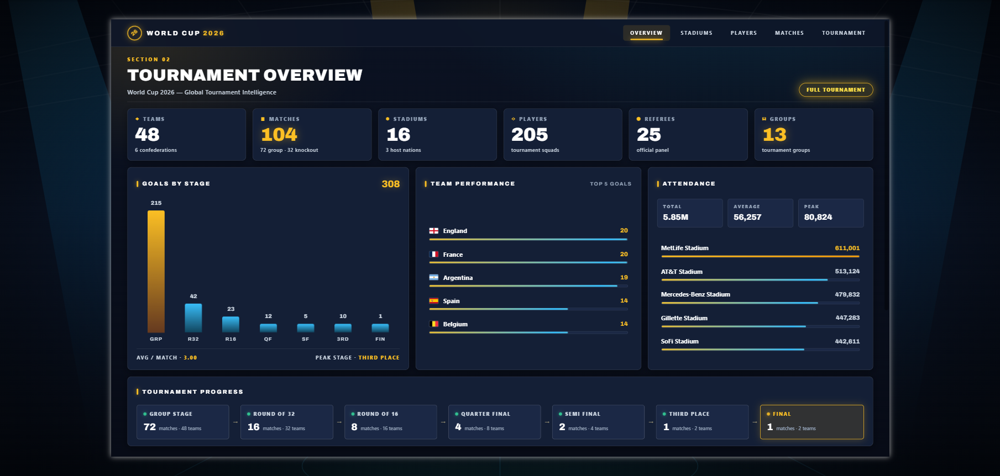
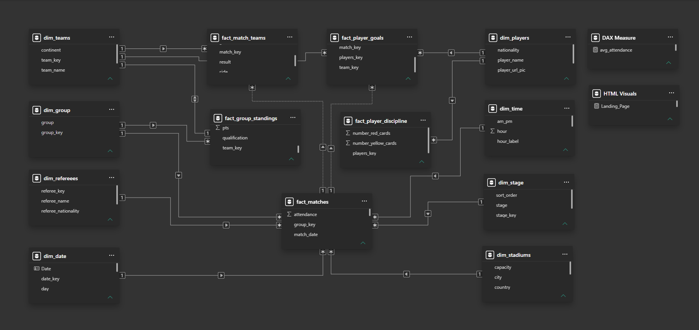
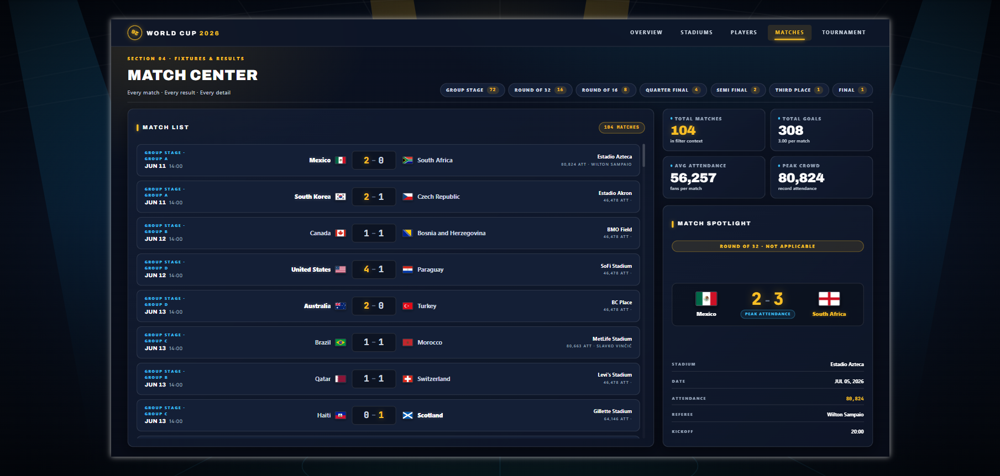
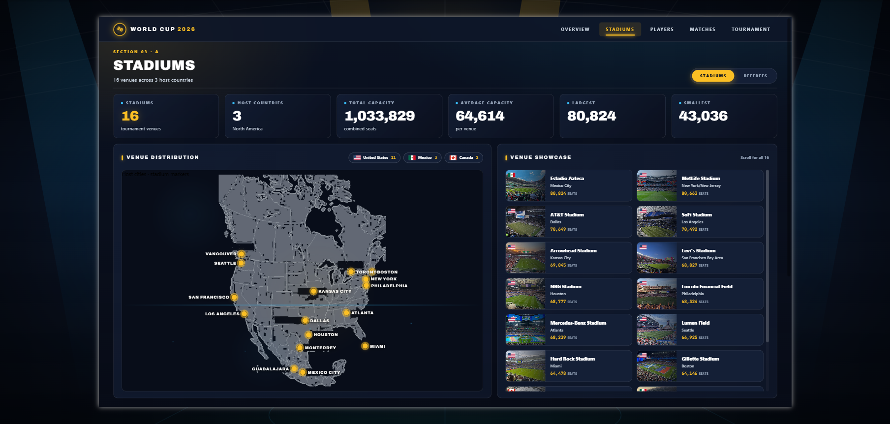
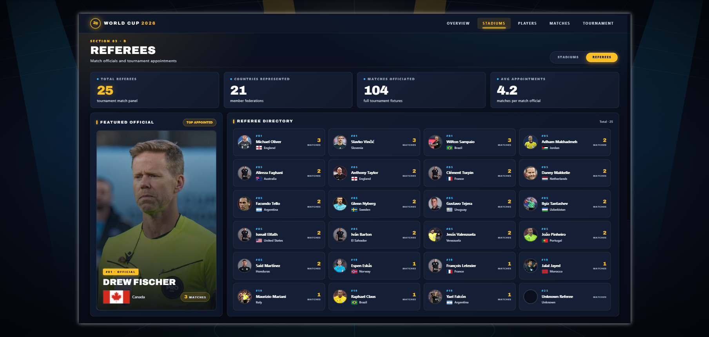

# ⚽ THE ROAD TO GLORY — FIFA World Cup 2026

> **FIFA WORLD CUP 2026 — DATA EXPERIENCE**

**The Road to Glory** is an interactive football analytics experience built around the **FIFA World Cup 2026**. Instead of presenting the tournament as a conventional BI dashboard, the project combines **web scraping, data cleaning, data modeling, Power BI, DAX, and custom HTML/CSS** to create a cinematic, sports-broadcast-inspired analytical experience.

The project turns structured tournament data into an interactive journey across **teams, matches, stadiums, tournament progression, players, scoring, and discipline**.

---

## 🖼️ Experience Screenshots

### Landing Page
<p align="center"></p>

### Overview
<p align="center"></p>

### Data Model
<p align="center"></p>

### Group Stage
<p align="center"></p>

### Knockout Stage
<p align="center"></p>

### Match Center
<p align="center"></p>

### Stadiums
<p align="center"></p>

### Top Scorers
<p align="center"></p>

### Own Goals
<p align="center"></p>

### Discipline
<p align="center"></p>

### Referees
<p align="center"></p>

---

## 🎯 Project Objective

The objective was to answer questions such as:

- How is the 48-team tournament structured?
- How does the competition move from the group stage into the knockout rounds?
- How are matches distributed across the tournament stages?
- Where are the matches played?
- Which players contribute to scoring?
- How is player discipline represented?
- How can football data be presented as an engaging analytical product rather than a collection of static charts?

The result is designed to feel closer to a **FIFA / ESPN-style tournament and match experience** than a traditional Power BI report.

---

## 📊 Tournament Data at a Glance

| Metric | Value |
|---|---:|
| 🌍 Teams | **48** |
| ⚽ Matches | **104** |
| 🥅 Goals | **308** |
| 🏟️ Stadiums | **16** |
| 📅 Group-Stage Matches | **72** |
| 🏆 Knockout Matches | **32** |
| 👤 Player Goal Records | **195** |
| 🟨 Discipline Records | **19** |
| 🗂️ Analytical Excel Tables | **11** |

### Derived tournament metrics

Using the dataset-level figures represented in the repository:

- **Average goals per match:** **2.96**
- **Group-stage share of all matches:** **69.23%**
- **Knockout-stage share of all matches:** **30.77%**
- **Matches per participating team:** **2.17** when calculated as total matches ÷ teams; this is a dataset-level ratio, not the number of matches played by an individual team.
- The **32-match knockout total** corresponds to a knockout model that includes the complete bracketed progression plus the additional knockout fixture represented in the dataset.

These ratios are intended to provide quick analytical context; they do not replace the dynamic calculations inside the Power BI model.

---

## 🔎 Data Analysis & Key Insights

### 1. Tournament scale

The model represents a **48-team, 104-match tournament** with **308 goals** across **16 stadiums**. With an overall average of **2.96 goals per match**, the dataset supports both tournament-level KPI analysis and detailed match/player exploration.

### 2. Group-stage concentration

The group stage contains **72 of the 104 matches**, meaning roughly **69% of all tournament fixtures** occur before the knockout phase. This makes group performance, standings, qualification paths, and group-level comparisons a major analytical component of the experience.

### 3. Knockout progression

The repository separates the knockout journey from the group stage and models progression through:

**Round of 32 → Round of 16 → Quarter-finals → Semi-finals → Final**

The match model also accounts for **AET (extra time)** and **PEN (penalty shootouts)**, allowing knockout outcomes to be represented without reducing every match to a simple regular-time score.

### 4. Scoring analysis

The player-goal fact table contains **195 player-goal records** and supports player-level scoring analysis. This feeds the **Top Scorers** experience as well as the own-goal analysis shown in the screenshots.

The model is structured so scoring information can be analyzed through the relationships between **players, matches, teams, and tournament stages**, rather than treating a scorer list as an isolated table.

### 5. Discipline analysis

The player-discipline fact table contains **19 discipline records** and provides a dedicated analytical path for player cards/discipline information.

The experience separates **Top Scorers** and **Discipline** so scoring performance and disciplinary events can be explored independently.

### 6. Stadium analysis

The tournament venue model contains **16 stadiums**, allowing the project to connect the tournament story to its physical locations. Stadium analysis is treated as its own experience rather than only as a match attribute.

### 7. Relational data model

The dataset is organized into dimension and fact tables, which makes the analytical layer more scalable than a single flat Excel sheet.

**Dimensions**
- Teams
- Players
- Stadiums
- Stages
- Groups
- Referees

**Facts**
- Matches
- Match Teams
- Group Standings
- Player Goals
- Player Discipline

This structure supports filtering and cross-analysis across tournament entities.

> **Data note:** The insights above are based on the repository's current dataset structure and the tournament-level figures represented by the model. Detailed player/team rankings are intentionally left to the dynamic Power BI calculations rather than duplicating potentially changing rankings in static README text.

---

## 🔄 End-to-End Data Pipeline

The project was built as a complete analytics workflow:

```text
Public Web Sources
        ↓
Python Web Scraping
        ↓
Beautiful Soup
        ↓
Raw Tournament Data
        ↓
Pandas
        ↓
Cleaning & Transformation
        ↓
Structured Excel Tables
        ↓
Power BI Data Model
        ↓
Power Query + DAX
        ↓
HTML + CSS
        ↓
Interactive FIFA World Cup 2026
Data Experience
```

### Web Scraping

**Beautiful Soup** was used to collect tournament information from publicly available web sources.

The scraping stage focused on extracting structured information such as:

- Teams
- Matches
- Stadiums
- Players
- Goals
- Discipline
- Groups
- Tournament stages
- Referee information

### Data Cleaning

**Pandas** was used after scraping to prepare the data for analysis.

The preparation workflow included:

- Cleaning raw records
- Standardizing fields
- Structuring dimension/fact datasets
- Handling inconsistencies
- Preparing analysis-ready Excel tables
- Separating player-level records from non-player notes where required

### BI Modeling

The cleaned data was loaded into Power BI and organized into a relational analytical model.

### DAX

DAX provides dynamic calculations for:

- Tournament KPIs
- Match statistics
- Stage analysis
- Player scoring
- Discipline
- Group standings
- Tournament progression
- Cumulative tournament metrics

### HTML & CSS

Custom HTML/CSS components extend the Power BI experience with a more immersive visual language, including tournament navigation, match cards, player-focused layouts, KPI treatments, and sports-broadcast-inspired presentation.

---

## 🗂️ Data Model

The repository currently contains **11 Excel tables**:

| Type | Table | Purpose |
|---|---|---|
| Dimension | `dim_teams.xlsx` | Team attributes |
| Dimension | `dim_players.xlsx` | Player information |
| Dimension | `dim_stadiums.xlsx` | Stadium information |
| Dimension | `dim_stage.xlsx` | Tournament stages |
| Dimension | `dim_group.xlsx` | Group structure |
| Dimension | `dim_refereees.xlsx` | Referee information |
| Fact | `fact_matches.xlsx` | Match-level records |
| Fact | `fact_match_teams.xlsx` | Team participation in matches |
| Fact | `fact_group_standings.xlsx` | Group-stage standings |
| Fact | `fact_player_goals.xlsx` | Player scoring records |
| Fact | `fact_player_discipline.xlsx` | Player discipline records |

This separation gives the Power BI model clear analytical grain and makes cross-filtering between tournament entities more reliable.

---

## 🏆 Tournament Structure

The experience follows the complete tournament journey:

```text
GROUPS A–L
    ↓
ROUND OF 32
    ↓
ROUND OF 16
    ↓
QUARTER-FINALS
    ↓
SEMI-FINALS
    ↓
FINAL
    ↓
🏆 CHAMPION
```

The knockout model supports match outcomes involving:

- Regular-time results
- Extra time (**AET**)
- Penalty shootouts (**PEN**)

Where exact goal timestamps are unavailable, cumulative goal storytelling follows the tournament/stage and match order rather than inventing minute-level timing.

---

## 🖥️ Experience Sections

### 🏠 Landing Page
A cinematic entry point introducing the **Road to Glory** concept.

### 📈 Overview
A high-level analytical view of tournament KPIs and the overall competition.

### 🌍 Group Stage
A structured view of the group phase, standings, and team progression.

### 🏆 Knockout Stage
A visual path through the knockout rounds and the road toward the final.

### ⚽ Match Center
A match-focused experience covering fixtures, results, stages, and match details.

### 🏟️ Stadiums
A venue-focused exploration of the tournament's 16 stadiums.

### ⭐ Players
A player-focused experience covering scoring and discipline.

### 🥅 Top Scorers & Own Goals
Dedicated views for player scoring and own-goal records.

### 🟨 Discipline
A separate player-discipline experience.

### 👨‍⚖️ Referees
A dedicated view for referee information and tournament context.

---

## 🎨 Design Philosophy

The project intentionally avoids the visual language of a conventional corporate dashboard.

The design direction combines:

- FIFA-inspired tournament presentation
- ESPN-style match-center concepts
- DAZN-inspired sports UI
- Broadcast graphics
- Data journalism
- Interactive analytics

The experience uses:

- Cinematic football visuals
- Strong typography
- Dynamic KPIs
- Tournament brackets
- Match cards
- Player tables
- Goal timelines
- Progress indicators
- HTML/CSS components
- Interactive navigation

The goal is to make the analytical layer feel like a **digital football product**, while keeping the underlying calculations data-driven.

---

## 🧠 Analytical Challenges

### Dynamic tournament calculations

Key statistics are calculated from the underlying model so filters and selections can change the analytical context.

### Match ordering

When exact goal timestamps are not available, cumulative analysis follows stage/match order rather than introducing unsupported timing assumptions.

### Knockout logic

The model distinguishes regular-time results from **AET** and **PEN** outcomes.

### Data quality

Because the source data originated from web scraping, cleaning and standardization were necessary before the information could be used reliably in the BI model.

### Player records

Player-level data required attention to non-player notes and record structure so that player analysis remains meaningful.

---

## 🛠️ Technology Stack

| Technology | Role |
|---|---|
| 🐍 Python | Web data collection and preparation |
| 🥣 Beautiful Soup | Web scraping |
| 🐼 Pandas | Cleaning and transformation |
| 📊 Power BI | Data modeling and analytical experience |
| 🧮 DAX | Dynamic calculations and KPIs |
| 🔄 Power Query | Data transformation inside Power BI |
| 🎨 HTML | Custom visual components |
| 🎨 CSS | Custom styling and layout |

---

## 📁 Repository Structure

```text
The-Road-To-Glory/
│
├── Assets/
│   ├── Matches.jpg
│   ├── Overview.jpg
│   ├── Players.jpg
│   ├── Stadium.jpg
│   ├── Stadiums.jpg
│   ├── Tournament.jpg
│   └── Trophy.png
│
├── Dataset/
│   ├── dim_group.xlsx
│   ├── dim_players.xlsx
│   ├── dim_refereees.xlsx
│   ├── dim_stadiums.xlsx
│   ├── dim_stage.xlsx
│   ├── dim_teams.xlsx
│   ├── fact_group_standings.xlsx
│   ├── fact_match_teams.xlsx
│   ├── fact_matches.xlsx
│   ├── fact_player_discipline.xlsx
│   └── fact_player_goals.xlsx
│
├── Screenshots/
│   ├── Landing Page.png
│   ├── Overview.png
│   ├── Group Stage.png
│   ├── Knockout Stage.png
│   ├── Matches.png
│   ├── Stadiums.png
│   ├── Top Scorers.png
│   ├── Top Own Scorers.png
│   ├── Discipline Players.png
│   ├── Referees.png
│   └── Model.png
│
├── LICENSE
├── README.md
└── THE ROAD TO GLORY.pbix
```

---

## 📚 Data Source

Tournament information was collected from publicly available web sources using Python and **Beautiful Soup**. The collected information was then cleaned and transformed with **Pandas** before being structured for Power BI analysis.

The project references publicly available tournament information, including:

[2026 FIFA World Cup — Wikipedia](https://en.wikipedia.org/wiki/2026_FIFA_World_Cup)

---

## 🎓 Project Context

**The Road to Glory** is a portfolio/graduation project demonstrating an end-to-end **Data Analyst / BI Developer** workflow:

**Web Data → Scraping → Cleaning → Data Modeling → DAX → Visualization → Interactive Data Experience**

The project focuses not only on producing correct analytical results, but also on communicating those results through a polished, football-specific user experience.

---

## 👤 Author

**Kerelos Nakhla Saad**

**Data Analyst | BI Developer**

- GitHub: [Kerelos-Nakhla](https://github.com/Kerelos-Nakhla)
- LinkedIn: [Kerelos Nakhla](https://www.linkedin.com/in/kerelos-nakhla/)

---

⭐ **Explore the repository to see the dataset, Power BI model, screenshots, and the complete analytical experience.**
